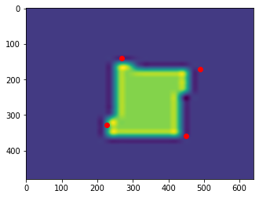

# 3. Поиск координат углов прямоугольника на изображении
Реализовать нейронную сеть, которая осуществляет поиск координат углов прямоугольников на изображении. В качестве обучающих и тестовых данных использовать ваш класс из п.1. Выходом обученной нейронной сети являются координаты 4 углов прямоугольника на изображении. Привести график функции потерь (loss function) в ходе обучения. Привести максимальное, минимальное и среднее значение L2 метрики (евклидово расстояние) для тестовой выборки из 1000 примеров для 2 разных checkpoint-ов обучения (промежуточного и финального).  

Реализована нейронная сеть на основе Lenet5 с пятью слоями: двумя сверточными и тремя полносвязными. На последнем слое сеть имеет 8 выходов по числу координат для предсказания.  
Изображения были преобразованы в черно-белый цвет размером 28х28 пикселей.  
Сеть обучалась на 400 эпохах с размером батча 100.  

## Результаты работы сети
Максимальное, минимальное и среднее значения L2 метрики (евклидово расстояние) для двух чекпоинтов обучения (200 и 400 финальная эпохи)  
```ruby
epoch = 200 
 L2 max, L2 min, L2 mean: (176, 3, 40.48)
epoch = 399 
 L2 max, L2 min, L2 mean: (416, 17, 85.29)
```

График потерь в ходе обучения   
  

Примеры детекции прямоугольников  
  
  
  
  
  
